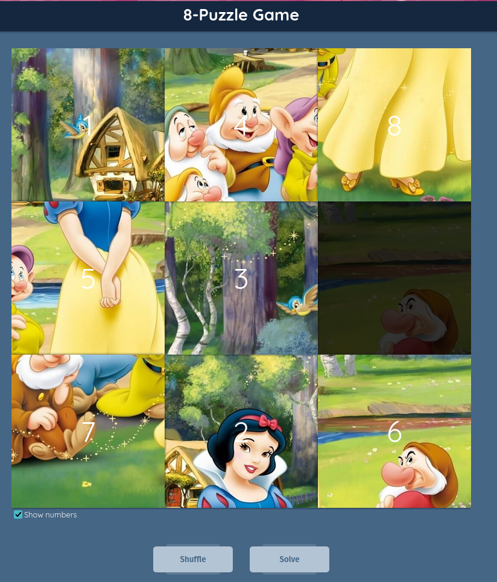
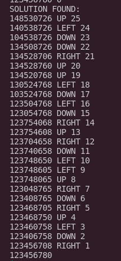

# 8-puzzle search algoriths solutions

This project consists of an agorithm collection, these algorithms are solutions to the 8-puzzle game found in https://murhafsousli.github.io/8puzzle/#/

## How to use

Just download this project, go to the directory and use `python blind-Breadth.py` command to start the Breadth-First-Search solution.

At the start of each program the CLI will ask you for the initial state of the game in STRING format.

The above state would correspond to the string `'148530726'`

Enter and the program will iterate until it finds the solution path.

Once it finds the solution path it will print it this format:

Where the first line of the solution corresponds to the starting state, each line of the solution have the following format: [STATE] [ACTION TO NEXT STATE] [Number of steps left for the solution state] and the last line is the goal state.

## Algorithms description

### Breadth-First-Search (blind-Breadth.py)

It's basically a brute-force algorithm, it will always expand the shallowest state so it will take a lot of time until it reaches the solution (half a hour aprox.), but it will surely reach to the most optimum solution.

### Best-First-Search (levenstein-Best.py)

It's a Greedy algorithm, that means it will always go for the state with the lowest levenstein distance and will only step back if it finds a dead-end. **It will always find a solution and faster that the Breadth-First-Search but said solution most likely compose of thousands of steps so i recommend to use `python levenstein-Best.py > levenstein-output.txt` for looking at the output in a good way.**

### A* algorithm (manhatan-A.py)

It will go for the state with the lowest manhatan distance (like the Best-First-Search with Levenstein distance) but will also take in consideration the number of steps taken from the initial state until the current state so it will ignore deep paths with low manhatan distance in pro of shallower paths with higher manhatan distance resulting in an algorithm that finds sub-optimum solutions (of few tens of steps) in a time way lower than the Breadth-First-Search.

### Formulations

So basically, the three algorithms depends of two functions to decide which state to expand, those two functions are deep and value (The value depends on a Heuristic function that's Levenstein distance in the case of the Best-First-Search and Manhatan distance in the case of the A* algorithm).

- Breadth-First-Search only cares about the deep of the states, always expanding the shallowest state
- Best-First-Search only cares about the value of a state (The heuristic function), always expanding the state with the less Levenstein distance even if other states lead to more optimum solutions.
- A* algorithm combines the two, it decides what state to choose considering the depth and the value, resulting in a combined function: `f(state) = depth(state) + ManhatanDistance(state)`. Always expanding the state with the lowest combined function.